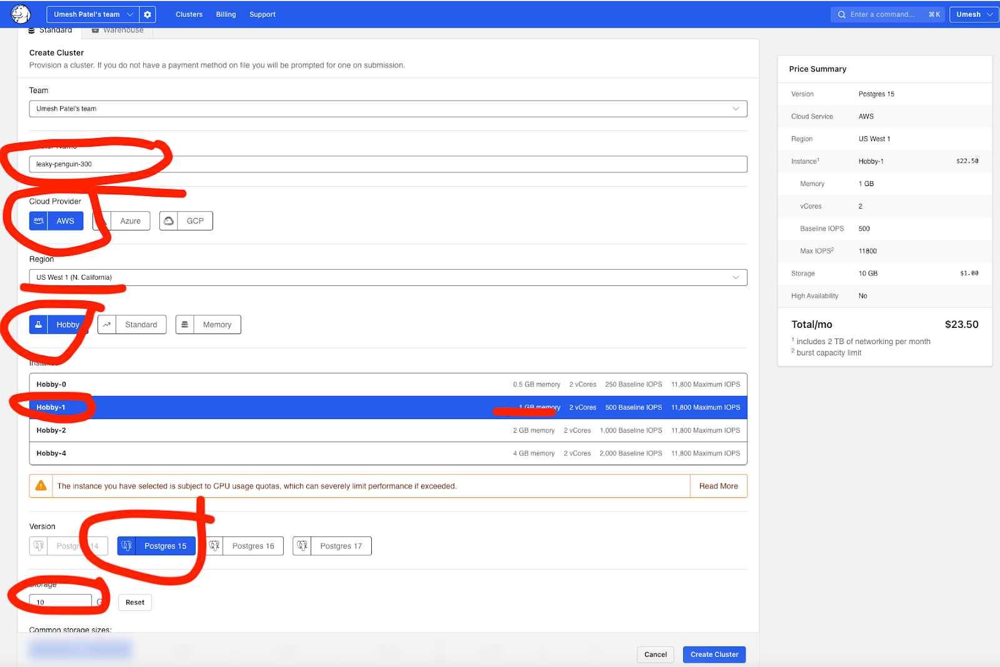
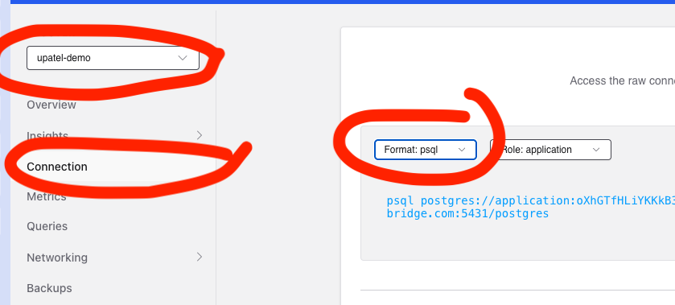
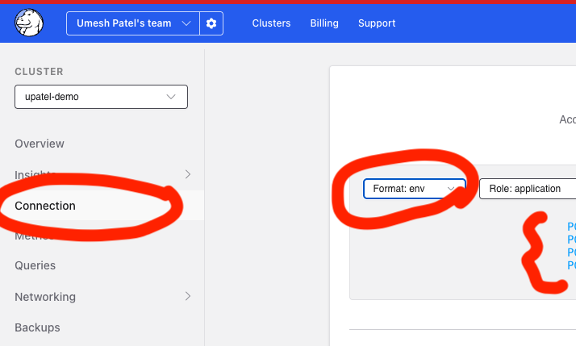
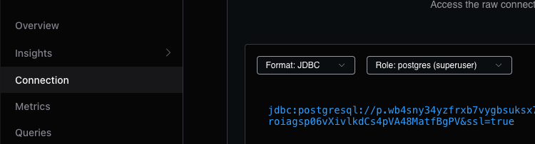

# This Setup guide is for setting up a Crunchy Bridge managed postgres database

## Step 1: Create the cluster



### Notes on creation

- You do not have to select AWS. Feel free to select Azure or GCP
- You do not have to pick the hobby tier
- For the version, POSTGRES 17 is recommended
- In 5 minutes or so the Postgres Cluster will be ready

## Step 2: Install postgres on your laptop

- For MACOS the command is: `brew install postgresl@17'

## Step 3: Obtain the connection info from Crunchy for the cluster

- Obtain the server, username, password, port, etc.

### Obtain the psl connection

- Select the 'postgres' role which is the superuser role which is
needed to create the publication



### Obtain the env connection



### Obtain the JDBC connection



## Step 4: Optional, load data into Crunchy postgres

`cb login` (please follow the instructions on the README.md to setup
crunchy bridge CLI)

`cb psql cluster-name --role postgres` (Cluster name found as below)


`\i retail.sql` (ensure this is conducted while the terminal working
directory is in the root of this project)

## Step 5: Optional, ensure data is properly loaded

```SQL
select * from information_schema.tables where table_schema = 'demo_retail';
-- to check row counts for all tables
WITH all_tables AS (
  SELECT 'categories' AS TABLE_NAME, COUNT (*) AS ROW_COUNT
  FROM demo_retail."categories"
  union ALL
  SELECT 'customers' AS TABLE_NAME, COUNT (*) AS ROW_COUNT
  FROM demo_retail."customers"
  union ALL
  SELECT 'orderitems' AS TABLE_NAME, COUNT (*) AS ROW_COUNT
  FROM demo_retail."orderitems"
  union ALL
  SELECT 'orders' AS TABLE_NAME, COUNT (*) AS ROW_COUNT
  FROM demo_retail."orders"
  union ALL
  SELECT 'productcategories' AS TABLE_NAME, COUNT (*) AS ROW_COUNT
  FROM demo_retail."productcategories"
  union ALL
  SELECT 'products' AS TABLE_NAME, COUNT (*) AS ROW_COUNT
  FROM demo_retail."products"
  union ALL
  SELECT 'reviews' AS TABLE_NAME, COUNT (*) AS ROW_COUNT
  FROM demo_retail."reviews"
)
select * from all_tables
union all
select 'all', sum(row_Count) from all_tables;
```

- Ensure that all tables have data loaded

## Step 6: Create a publication using the super user 'postgres' role

- If logged into cb psql then just run the below command (if not login
as per step 4)

`CREATE PUBLICATION retail_openflow FOR TABLES in SCHEMA demo_retail;`

- Check that the publication is created

`SELECT * FROM pg_publication_tables WHERE pubname='retail_openflow';`
