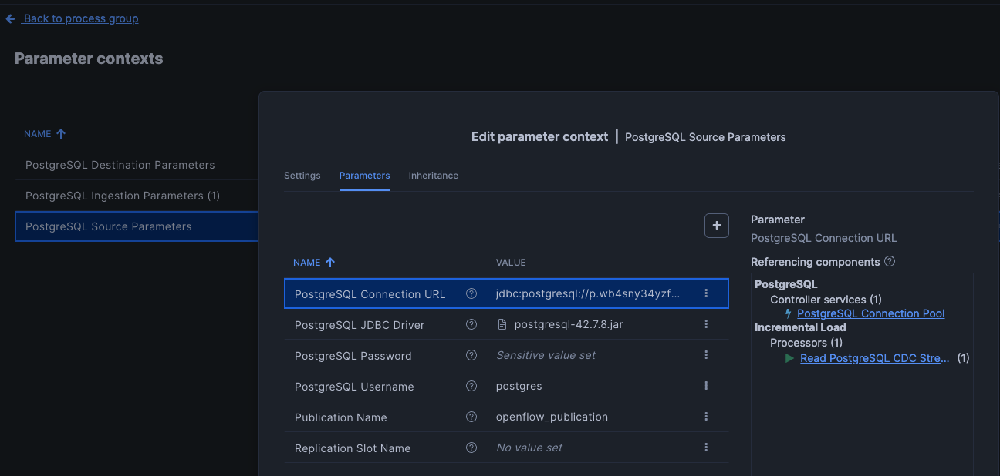
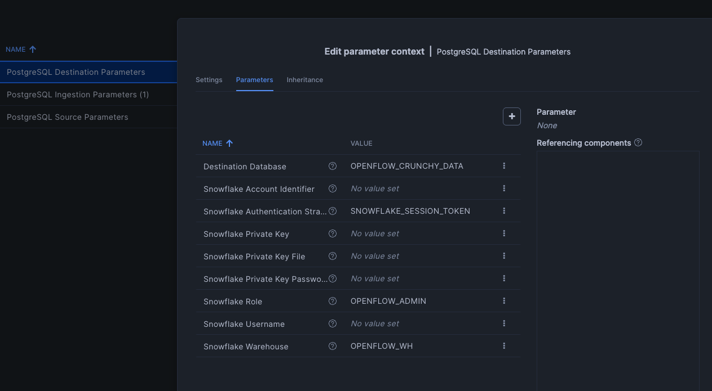
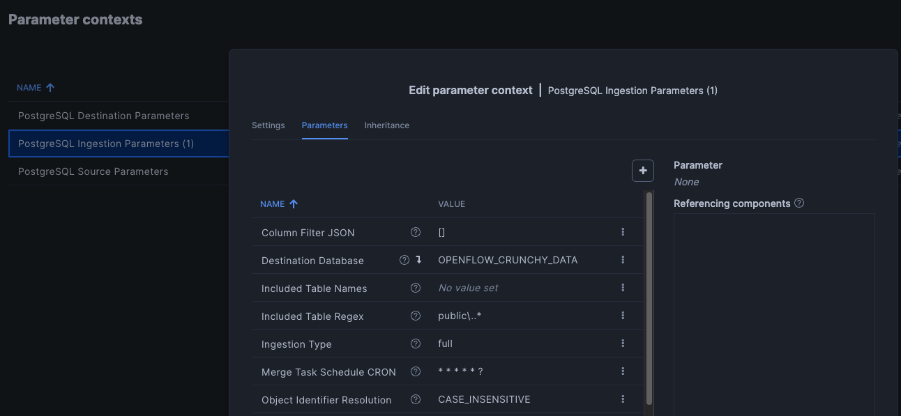
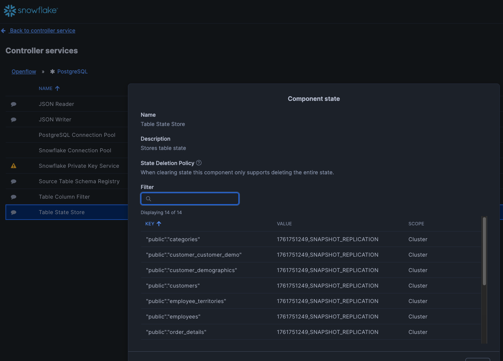

# How to run the OpenFlow Quickstart using Crunchy Bridge

This guide will help you set up a Crunchy Bridge PostgreSQL database,
configure Snowflake Openflow CDC pipelines, and deploy a production
Streamlit application to Snowflake for monitoring real-time data
replication.

## About This Quickstart

This quickstart is adapted from the
[Snowflake Openflow CDC on SQL Server quickstart](https://quickstarts.snowflake.com/guide/getting_started_with_openflow_for_cdc_on_sql_server/index.html)
but **modified for PostgreSQL** using Crunchy Bridge instead of SQL
Server on AWS RDS.

**Official Snowflake Openflow SPCS Setup Guide**: This quickstart also
references the
[Getting Started with Openflow SPCS](https://quickstarts.snowflake.com/guide/getting_started_with_Openflow_spcs/index.html?index=..%2F..index#1)
guide for the foundational Snowflake infrastructure setup (roles,
network rules, and deployments).

### What You Will Learn

By the end of this guide, you will learn to:

- Set up a cloud-hosted PostgreSQL database using Crunchy Bridge
- Install and configure the Crunchy Bridge CLI (`cb`) for database
  management
- Install PostgreSQL client tools (`psql`) for local database
  connections
- Configure and deploy Openflow CDC pipelines between PostgreSQL and
  Snowflake
- Import sample databases and configure replication identity for
  Change Data Capture (CDC)
- Deploy a production-ready Streamlit application to Snowflake for
  monitoring and managing your CDC pipeline
- Run test queries and validate real-time data replication

### What is Snowflake Openflow?

[Openflow](https://www.snowflake.com/en/data-cloud/solutions/data-movement/openflow/)
is a cloud-native data movement platform built on Apache NiFi,
designed specifically for scalable, real-time streaming and Change
Data Capture (CDC) pipelines. It provides a unified experience for
building and monitoring data integration workflows, complete with
built-in observability and governance.

### Key Differences: PostgreSQL vs SQL Server

This guide adapts the original SQL Server quickstart to work with
PostgreSQL:

| Aspect | SQL Server (Original) | PostgreSQL (This Guide) |
|--------|----------------------|------------------------|
| **Database Host** | AWS RDS SQL Server | Crunchy Bridge Cloud |
| **CLI Tool** | SQL Server Management Studio (SSMS) | Crunchy Bridge CLI (`cb`) |
| **Change Tracking** | SQL Server Change Tracking (CT) | PostgreSQL Replication Identity (REPLICA IDENTITY FULL) |
| **Sample Database** | Microsoft Northwind | PostgreSQL Northwind (Community Port) |

### High-Level Steps

1. **Setup a Crunchy Bridge Database** - Create a managed PostgreSQL
   cluster in the cloud
1. **Install the Crunchy Bridge CLI** - Set up command-line tools to
   manage your database
1. **Install PostgreSQL Client Tools** - Install `psql` for local
   database connections
1. **Connect to Your Database** - Verify connectivity to your Crunchy
   Bridge cluster
1. **Enable Replica Identity** - Configure PostgreSQL for CDC
   capabilities
1. **Import the Northwind Database** - Load sample data for testing
1. **Run Test Queries** - Validate your setup with console.sql
   commands

## Prerequisites

- macOS (for Homebrew installation)
- A Crunchy Bridge account (sign up at
[crunchybridge.com](https://www.crunchybridge.com))

## 1. Setup a Crunchy Bridge Database

> **📖 Detailed Setup Guide**: For a more detailed step-by-step guide
> with screenshots and additional configuration options, see
> [CRUNCHY_SETUP.md](CRUNCHY_SETUP.md).

### Create Your Account

1. Go to [crunchybridge.com](https://www.crunchybridge.com)
1. Sign up for a free account or log in to your existing account

### Create a New Database Cluster

1. From the Crunchy Bridge dashboard, click **Create Cluster**
1. Choose your configuration:

   - **Cluster Name**: Choose a meaningful name (e.g.,
     `openflow-quickstart`)
   - **Plan**: Select a plan that fits your needs (free tier
     available)
   - **Region**: Choose a region close to you
   - **PostgreSQL Version**: Select the latest stable version

1. Click **Create Cluster**
1. Wait for the cluster to be provisioned (usually takes 1-2 minutes)

### Get Your API Credentials (for CLI access)

1. Navigate to
   [Account Settings](https://www.crunchybridge.com/settings/)
1. Click **Create API Key**
1. Save the **Application ID** and **Application Secret** (you'll
   need these later)

## 2. Install the Crunchy Bridge CLI

The Crunchy Bridge CLI (`cb`) allows you to manage your databases
from the command line.

### Installation via Homebrew

```bash
brew install CrunchyData/brew/cb
```

### Verify Installation

```bash
cb version
```

You should see output like: `cb v3.6.6 (1c449c4)`

### Authenticate the CLI

```bash
cb login
```

When prompted, enter your **Application ID** and **Application
Secret** from step 1, or follow the browser-based authentication flow.

### Verify Authentication

```bash
cb whoami
```

This will display your username, confirming successful authentication.

### View Your Clusters

```bash
cb list
```

This will show all your database clusters.

## 3. Install PostgreSQL Client Tools

The `psql` command-line client is required to connect to your Crunchy
Bridge database.

### Install PostgreSQL 17.6 via Homebrew

```bash
brew install postgresql@17
```

### Add PostgreSQL to Your PATH

Add the following line to your `~/.zshrc` file:

```bash
echo 'export PATH="/opt/homebrew/opt/postgresql@17/bin:$PATH"' >> ~/.zshrc
```

### Apply the Changes

Either restart your terminal or run:

```bash
source ~/.zshrc
```

### Verify Installation

```bash
psql --version
```

You should see: `psql (PostgreSQL) 17.6 (Homebrew)`

## 4. Connect to Your Crunchy Bridge Database

### Using the CLI (Recommended)

The easiest way to connect is using the `cb` CLI:

```bash
cb psql <your-cluster-name>
```

This will automatically connect you to your database with the correct
credentials.

### Using Connection String

You can also get the connection URI and use it directly:

```bash
cb uri <your-cluster-name>
```

Then connect using:

```bash
psql "<connection-uri>"
```

## 4.1 Enable Replica Identity (Optional but Recommended)

If you plan to use Change Data Capture (CDC) or replication features,
you should enable replica identity on your tables.

### Step 1: Connect as the Postgres User

```bash
cb psql <your-cluster-name> --role postgres
```

### Step 2: Run the Console Script

From within the psql terminal, execute the console.sql script to set
up replica identity for all tables:

```sql
\i console.sql
```

This script will:

- Create a replication user
- Set `REPLICA IDENTITY FULL` on all tables (required for CDC and
replication)
- Configure change tracking settings

You should see output confirming that the commands executed
successfully. Once complete, exit psql:

```sql
\q
```

## 5. Import the Northwind Database (Optional)

If you want to import the sample Northwind database:
The file is from this repo:
<https://github.com/pthom/northwind_psql/blob/master/northwind>

### Step 1: Login to Crunchy Bridge CLI

```bash
cb login
```

A browser window will open. Follow the on-screen instructions to
authenticate. Once authenticated, return to your terminal.

### Step 2: Connect to Your Database as the Postgres User

Connect to your cluster using the `postgres` role (superuser) to
ensure you have the necessary permissions:

```bash
cb psql <your-cluster-name> --role postgres
```

Replace `<your-cluster-name>` with your actual cluster name (e.g.,
`openflow-quickstart`).

### Step 3: Import the SQL File

Once inside the `psql` interactive terminal, import the Northwind
database using:

```sql
\i northwind.sql
```

This will execute all the SQL commands in the `northwind.sql` file
and create the Northwind database schema and data.

### Step 4: Verify the Import

To verify the import was successful, you can run:

```sql
\dt
```

This will list all tables in the current schema. You should see
tables like `categories`, `customers`, `employees`, `orders`, etc.

### Step 5: Exit psql

To exit the psql session, type:

```sql
\q
```

## 6. OpenFlow Setup in Snowflake

This section covers the Snowflake-side setup required to run Openflow
for Change Data Capture (CDC) from your PostgreSQL database.

### Prerequisites

- A Snowflake account (with ACCOUNTADMIN role access)
- Snowflake Openflow access (not available on free trial)
- Snowpark Container Services (SPCS) enabled on your account

### Step 1: Prepare Snowflake Core Components

Before creating an Openflow deployment, you need to configure core
Snowflake components including the `OPENFLOW_ADMIN` role and network
rules.

#### Run the Setup Script

1. Download the `setup_roles.sql` file from this repository
1. Log into your Snowflake account via Snowsight
1. Navigate to **Projects → Worksheets**
1. Click **"+ Worksheet"** to create a new worksheet
1. Copy and paste the contents of `setup_roles.sql` into the
   worksheet
1. Click the **▶ Run All** button (or Ctrl+Enter) to execute all
   commands

This script will:

- Create the `OPENFLOW_ADMIN` role with necessary privileges
- Create a network rule for Openflow deployments to communicate with
  Snowflake services
- Verify all components are configured correctly

#### Verify the Setup

After running the script, you should see:

- Role `OPENFLOW_ADMIN` created successfully
- Network rule `snowflake_deployment_network_rule` created
- All verification queries returning successful results

**Important**: Note any error messages about network policies (Step 3
in the script). If you have an account-level network policy, you may
need to uncomment and run that section with your policy name.

### Step 2: Create Openflow Deployment

With Snowflake core components configured, create the Openflow
deployment:

1. Verify your active role is `OPENFLOW_ADMIN` in the top-left corner
   of Snowsight

   - If not, click your user menu and switch to the `OPENFLOW_ADMIN`
     role

1. Navigate to **Data → Ingestion → Openflow**

1. Click the **Deployments** tab

1. Click **Create Deployment** and fill in:

   - **Deployment Location**: Select `Snowflake`
   - **Name**: Enter `CDC_POSTGRES_DEPLOYMENT` (or your preferred
     name)
   - Complete the configuration wizard

1. Wait for the deployment to reach **ACTIVE** status (usually 3-5
   minutes)

### Step 3: Create Runtime Role and Resources

Create a runtime role that will be used by your Openflow runtime to
access Snowflake resources:

```sql
-- Create runtime role
USE ROLE ACCOUNTADMIN;
CREATE ROLE IF NOT EXISTS POSTGRES_RUNTIME_ROLE;

-- Create database for Openflow resources
CREATE DATABASE IF NOT EXISTS POSTGRES_CDC_DB;

-- Create warehouse for data processing
CREATE WAREHOUSE IF NOT EXISTS POSTGRES_CDC_WH
  WAREHOUSE_SIZE = MEDIUM
  AUTO_SUSPEND = 300
  AUTO_RESUME = TRUE;

-- Grant privileges to runtime role
GRANT USAGE ON DATABASE POSTGRES_CDC_DB TO ROLE POSTGRES_RUNTIME_ROLE;
GRANT USAGE ON WAREHOUSE POSTGRES_CDC_WH TO ROLE POSTGRES_RUNTIME_ROLE;
GRANT CREATE SCHEMA ON DATABASE POSTGRES_CDC_DB TO ROLE POSTGRES_RUNTIME_ROLE;

-- Grant runtime role to Openflow admin
GRANT ROLE POSTGRES_RUNTIME_ROLE TO ROLE OPENFLOW_ADMIN;
```

### Step 4: Create External Access Integration

Create an External Access Integration to allow your Openflow runtime
to connect to your PostgreSQL database on Crunchy Bridge:

```sql
USE ROLE OPENFLOW_ADMIN;

-- Create network rule for PostgreSQL connectivity
CREATE OR REPLACE NETWORK RULE postgres_network_rule
  MODE = EGRESS
  TYPE = IPV4
  VALUE_LIST = ('<your-crunchy-bridge-ip>');
-- Replace with your Crunchy Bridge IP
--   You may want to end your URL with the port 5432 if it does not work
-- e.g.: p.YOUR_CLUSTER_ID.db.postgresbridge.com:5432

**Note**: Replace `<your-crunchy-bridge-ip>` with your Crunchy
Bridge database IP address. You can find this by connecting to your
database:

-- Create external access integration
CREATE OR REPLACE EXTERNAL ACCESS INTEGRATION POSTGRES_EAI
  ALLOWED_NETWORK_RULES = (postgres_network_rule)
  ENABLED = TRUE;
```

```bash
cb uri <your-cluster-name>
```

### Step 5: Create Openflow Runtime

Create a runtime that will execute the PostgreSQL connector:

1. Navigate to **Data → Ingestion → Openflow → Runtimes** tab

2. Click **Create Runtime** and configure:
   - **Deployment Name**: Select `CDC_POSTGRES_DEPLOYMENT`
   - **Runtime Name**: Enter `POSTGRES_CDC_RUNTIME`
   - **Node Type**: Select `M`
   - **Min Nodes**: `1`
   - **Max Nodes**: `1`
   - **Runtime Role**: Select `OPENFLOW_ADMIN`
   - **External Access Integration**: Select `POSTGRES_EAI`
   - **Compute Pool**: Select an existing compute pool

3. Click **Create** and wait for status to show **ACTIVE** (3-5
   minutes)

**Important Notes**:

- Using `OPENFLOW_ADMIN` as the runtime role simplifies permissions
  management
- The `POSTGRES_EAI` external access integration allows the runtime
  to connect to your Crunchy Bridge PostgreSQL database
- Ensure the external access integration was created successfully in
  Step 4 before proceeding

### Step 6: Configure the Openflow Runtime with PostgreSQL JDBC Driver

Before you can use the PostgreSQL connector, you need to upload the
PostgreSQL JDBC driver to your Openflow runtime.

#### Download the PostgreSQL JDBC Driver

1. Visit the
   [PostgreSQL JDBC Driver download page](https://jdbc.postgresql.org/download/)

1. Download the latest version for your Java version:

   - **For Java 8 or newer**: Download version **42.7.8** (JDBC 4.2)
   - **For Java 7**: Download version **42.2.29** (JDBC 4.1)
   - **For Java 6**: Download version **42.2.27** (JDBC 4.0)

1. **Recommended**: Use version **42.7.8** for the best
   compatibility and security features

#### Upload the JDBC Driver to Your Runtime

1. Navigate to **Data → Ingestion → Openflow → Runtimes** tab

1. Click on your runtime (`POSTGRES_CDC_RUNTIME`) to open the canvas

1. From the runtime canvas, click the **hamburger menu** (☰) in the
   top-right corner

1. Select **Controller Settings**

1. Navigate to the **NAR Auto-Load** or **Extensions** section

1. Click **Upload** or **Add Extension**

1. Select the downloaded PostgreSQL JDBC JAR file (e.g.,
   `postgresql-42.7.8.jar`)

1. Click **Apply** to save the changes

1. **Important**: Restart the runtime for the driver to be loaded:

   - Go back to **Data → Ingestion → Openflow → Runtimes**
   - Select your runtime
   - Click **Actions** → **Restart**
   - Wait for the runtime to return to **ACTIVE** status

**Alternative Method - Using File Upload**:

If your Openflow deployment supports direct file uploads:

1. Open your runtime canvas
1. Go to **Controller Settings** → **NAR Auto-Load Directory**
1. Note the directory path (typically
   `/opt/nifi/nifi-current/extensions`)
1. Upload the JAR file to this directory using the file upload
   mechanism in Openflow
1. Restart the runtime to load the driver

**Verification**:

After restarting, verify the driver is loaded:

- The PostgreSQL JDBC driver should appear in the list of available
drivers when configuring database connection pools
- You should see `org.postgresql.Driver` as an available driver class

### Step 7: Configure PostgreSQL CDC Connector

Once your runtime is active, configure the PostgreSQL connector:

1. Navigate to **Data → Ingestion → Openflow**

1. On the **Overview** tab, find the **PostgreSQL** connector and
   click **Add to Runtime**

1. Select `POSTGRES_CDC_RUNTIME` from the dropdown and click **Add**

1. Authenticate with your Snowflake credentials when prompted

1. Double-click the PostgreSQL process group to view the
   configuration

1. Right-click on the **Incremental Load** process group and select
   **Parameters**

1. Update the configuration parameters:

### PostgreSQL Source Parameters

- **PostgreSQL Connection URl**: PostgreSQL connection string (get
  from `cb uri <your-cluster-name>`)

  Also, you may need to append `&sslmode=require` for it to work
  For example (replace the CLUSTEr and PASSWORD with your own):

```text
jdbc:postgresql://p.CLUSTER.db.postgresbridge.com/postgres?user=postgres&password=PASSWORD&ssl=true&sslmode=require
```

- PostgreSQL JDBC Driver: Should list postgresql-42.7.8.jar
- **PostgreSQL Password**: Your PostgreSQL password
- **PostgreSQL Username**: Your PostgreSQL username - Should be
  postgres for simplification
- **Publication Name**: Should be the publication name from when you
  setup crunchy

  For this example it should be `retail_openflow`
  See screenshot for an example
  

### PostgreSQL Destination Parameters

- **Destination Database**: `POSTGRES_CDC_DB`

  ENSURE that this database exists and the role that is running
  Openflow has access to add new tables and schemas to this database

- **Snowflake Authentication Strategy**: `SNOWFLAKE_SESSION_TOKEN` as
  it is using the SPCS session token to authenticate
- **Snowflake Role**: Ensure you use the role you provide for the
  runtime (should be OPENFLOW_ADMIN)
- **Snowflake Warehouse**: Ensure you use a warehouse the role
  operating the runtime has access to

  For this case POSTGRES_CDC_WH
  See screenshot for an example
  

### PostgreSQL Ingestion Parameters

- **Destination Database**: Select the Snowflake database to load
  into, ensure the openflow runtime role has access to this database
- **Included table names**: Select tables/views in here via
  `schema.table` syntax

  I HIGHLY suggest only adding one table at a time (skip the regex
  option) to ensure this works for instance just add
  demo_retail.categories initially

- **Included Table Regex**: Select tables via regex

  For instance in this case you would place in here
  `demo_retail\..*' to include all tables from the demo_retail schema
  to load the 7 tables

- **Merge Task Schedule CRON**: Sets the schedule for how often
  merges happen
- **Object Identifier Resolution**: Set this to `CASE_INSENSITIVE` if
  you want merges into Snowflake to be case insensitive so you do not
  need to quote in SELECT statements

  See screenshot for an example
  

### Check if this worked

Go into Controller services - Table State Store - View State
This will allow you to see the state of the tables selected
See screenshot:


The tables should read SNAPSHOT_REPLICATION

### Step 8: Start the Connector

1. Right-click on the canvas and select **Enable all Controller
   Services**

1. Right-click on the **postgresql-connector** process group and
   select **Start**

1. The connector will now begin streaming data from PostgreSQL to
   Snowflake in real-time

### Step 9: Verify Real-Time Data Replication

Query your target tables in Snowflake to confirm data is being
replicated:

```sql
USE DATABASE POSTGRES_CDC_DB;
USE SCHEMA DEMO_RETAIL;

-- Check orders table
SELECT * FROM CATEGORIES LIMIT 10;

-- Check customers table
SELECT * FROM CUSTOMERS LIMIT 10;

-- Monitor connector activity
SELECT * FROM INFORMATION_SCHEMA.LOAD_HISTORY
WHERE SCHEMA_NAME = 'PUBLIC'
ORDER BY LOAD_START_TIME DESC
LIMIT 10;
```

### Step 10: Optional - Test data propagation from Crunchy to Snowflake

```sql
INSERT INTO demo_retail.categories ("CategoryId", "CategoryName", "Description")
VALUES (3, 'Board_games', 'board games');
```

And try this as well:

```sql
INSERT INTO demo_retail.products ("ProductId", "ProductName", "Description", "Price", "StockQuantity", "DateAdded", "LastUpdated")
VALUES (4, 'MacbookAir', 'Macbook Air', 2000.00, 1, '2025-07-01'::TIMESTAMP, '2025-07-01'::TIMESTAMP);
```

Then check that the Stream, stream table, and the row is merged into
the base table.

#### Troubleshooting

- If you have problems with Tables never completing snapshot or
  transitioning to incremental load you may need to remove the table
  from replication in Openflow, remove the corresponding table, table
  stream, and stream from Snowflake. Then re-add it.

## Common Commands

### Cluster Management

- `cb list` - List all clusters
- `cb info <cluster-name>` - Get detailed cluster information
- `cb restart <cluster-name>` - Restart a cluster
- `cb suspend <cluster-name>` - Temporarily turn off a cluster
- `cb resume <cluster-name>` - Turn on a suspended cluster

### Database Operations

- `cb psql <cluster-name>` - Connect to database
- `cb logs <cluster-name>` - View live cluster logs
- `cb backup list <cluster-name>` - List backups

### Role Management

- `cb role list <cluster-name>` - List database roles
- `cb role create <cluster-name> --name <username>` - Create a new
role

## Troubleshooting

### "psql command not found"

Make sure PostgreSQL is installed and added to your PATH (see Step
3).

### "Permission denied for schema DEMO_RETAIL"

Make sure you're connected with a user that has proper permissions.
You can grant permissions by connecting as an admin user and running:

```sql
GRANT ALL ON SCHEMA demo_retail TO your_username;
GRANT ALL PRIVILEGES ON ALL TABLES IN SCHEMA demo_retail TO your_username;
```

### "API authentication failed"

Re-run `cb login` and ensure you're using the correct Application ID
and Secret from your account settings.

## Additional Resources

- [Crunchy Bridge Documentation](https://docs.crunchybridge.com/)
- [Crunchy Bridge CLI GitHub](https://github.com/CrunchyData/bridge-cli)
- [PostgreSQL Documentation](https://www.postgresql.org/docs/)

## Project Files Reference

This repository includes several files to help you get started:

### SQL Scripts

- **`setup_roles.sql`** - Snowflake setup script that creates the
  OPENFLOW_ADMIN role, network rules, and required configurations
  (see Step 1 in Section 6)
- **`console.sql`** - PostgreSQL helper script for setting up
  replication users, enabling REPLICA IDENTITY on tables, and testing
  data (see Section 4.1)
- **`northwind.sql`** - Sample Northwind database schema and data for
  PostgreSQL (optional, see Section 5)
- **`retail.sql`** - Demo retail database with customers, products,
  orders, and categories tables. Referenced in CRUNCHY_SETUP.md

### Python Applications

- **`combined_customer_management.py`** - Full-featured Streamlit
  application for managing customers in both PostgreSQL and Snowflake
  with CRUD operations, search, pagination, and bulk insert
  capabilities. Can be run locally or deployed to Snowflake Streamlit
  in Snowflake (SiS). See usage instructions below.
- **`requirements.txt`** - Python dependencies for local development
  or Snowflake Streamlit deployment

### Configuration Files

- **`pyproject.toml`** - Python project configuration with
  dependencies (used by UV package manager)
- **`.gitignore`** - Git ignore patterns for Python projects

## Using the Customer Management Application

The `combined_customer_management.py` file is a comprehensive
Streamlit application that demonstrates CDC (Change Data Capture)
in action by allowing you to manage customer data in PostgreSQL
and view the replicated data in Snowflake.

**Deployment Options:**

- 🏠 **Local Development**: Run on your machine for testing and
  development
- ☁️ **Snowflake Streamlit in Snowflake (SiS)**: Deploy directly to
  Snowflake for production use with built-in authentication and scaling

### Option 1: Run Locally (Development)

#### Prerequisites

First, install UV (if not already installed):

```bash
# On macOS/Linux
curl -LsSf https://astral.sh/uv/install.sh | sh

# Or using Homebrew
brew install uv
```

Then install the required Python packages:

```bash
# Install dependencies using UV (recommended - much faster!)
uv pip install -e .

# Or use the traditional pip method
pip install -r requirements.txt
```

#### Configuration

Before running the app, update the connection parameters in
`combined_customer_management.py`:

```python
# PostgreSQL configuration (lines 10-16)
PG_HOST_NAME = "p.YOUR_CLUSTER_ID.db.postgresbridge.com"
PG_PORT = "5432"
PG_USERNAME = "application"
PG_PASSWORD = "your_password"

# Snowflake configuration (lines 19-24)
SF_ACCOUNT = "your-account"
SF_USERNAME = "your-username"
SF_DATABASE = "POSTGRES_CDC_DB"
SF_PRIVATE_KEY_PATH = "/path/to/your/private_key.p8"
```

#### Running Locally

```bash
# Using UV (automatically handles virtual environment)
uv run streamlit run combined_customer_management.py

# Or run directly if already installed
streamlit run combined_customer_management.py
```

**Note**: UV automatically manages virtual environments, so you don't
need to manually create or activate one. The `uv run` command ensures
dependencies are installed and runs the application in an isolated
environment.

### Option 2: Deploy to Snowflake (Production)

Deploy the Streamlit app directly to Snowflake for production use
with built-in authentication, scaling, and security.

#### Prerequisites

- Snowflake account with Streamlit support
- `ACCOUNTADMIN` or appropriate role with Streamlit privileges
- Completed the Openflow setup (Section 6)

#### Step 1: Create Streamlit App in Snowsight

1. Log into Snowsight (Snowflake Web UI)
2. Navigate to **Projects → Streamlit**
3. Click **+ Streamlit App**
4. Configure the app:
   - **Name**: `CUSTOMER_MANAGEMENT_APP`
   - **Database**: Select `POSTGRES_CDC_DB` (or your target database)
   - **Schema**: Select `DEMO_RETAIL`
   - **Warehouse**: Select your compute warehouse (e.g.,
     `POSTGRES_CDC_WH`)

#### Step 2: Upload the Application Code

1. In the Streamlit editor that opens, delete the default template
   code
2. Copy the entire contents of `combined_customer_management.py`
3. Paste into the Snowflake Streamlit editor
4. Update the configuration at the top of the file:

```python
# PostgreSQL configuration
PG_HOST_NAME = "p.YOUR_CLUSTER_ID.db.postgresbridge.com"
PG_PORT = "5432"
PG_USERNAME = "application"
PG_PASSWORD = "your_password"

# Snowflake configuration - use Snowflake session context
SF_ACCOUNT = "your-account"
SF_USERNAME = "your-username"
SF_DATABASE = "POSTGRES_CDC_DB"
SF_PRIVATE_KEY_PATH = "/path/to/your/private_key.p8"
```

#### Step 3: Install Dependencies

In the Snowflake Streamlit editor, create a `requirements.txt` section
or use the packages panel to add:

```text
pandas>=1.5.0
faker>=20.0.0
psycopg2-binary>=2.9.0
snowflake-connector-python>=3.0.0
cryptography>=41.0.0
PyJWT>=2.8.0
```

**Note**: Streamlit is pre-installed in Snowflake, so you don't need
to include it.

#### Step 4: Run the App

1. Click **Run** in the Snowflake Streamlit editor
2. The app will start and be accessible via a Snowflake URL
3. Share the URL with your team for secure, authenticated access

#### Advantages of Snowflake Deployment

- ✅ **Built-in Authentication**: Uses Snowflake user authentication
- ✅ **No Infrastructure**: Snowflake manages hosting and scaling
- ✅ **Secure**: Data never leaves Snowflake environment
- ✅ **Easy Sharing**: Share via URL with Snowflake users
- ✅ **Version Control**: Built-in versioning in Snowflake
- ✅ **Cost Efficient**: Only pay for compute when app is running

### Features

- **PostgreSQL Operations**: Full CRUD (Create, Read, Update, Delete)
  operations on customer records
- **Snowflake Viewer**: Read-only view of replicated customer data
- **Bulk Operations**: Generate and insert random customer data for
  testing CDC at scale
- **Search & Pagination**: Find and browse customer records
- **Real-time Validation**: Email, phone, and ZIP code validation

### Use Cases

This app is perfect for:

1. **Testing CDC Pipelines**: Insert data into PostgreSQL and verify
   it propagates correctly to Snowflake via Openflow
2. **Production Monitoring**: Deploy to Snowflake Streamlit for
   secure, authenticated access to monitor your CDC pipeline
3. **Stakeholder Demos**: Demonstrate real-time data replication to
   business users through an intuitive UI
4. **Load Testing**: Use bulk insert features to test CDC pipeline
   performance at scale
5. **Self-Service Analytics**: Enable business users to query both
   source (PostgreSQL) and target (Snowflake) systems

## Quick Reference: UV Commands

UV is a fast, modern Python package manager written in Rust. Here are
some useful commands:

```bash
# Install UV
brew install uv  # macOS
curl -LsSf https://astral.sh/uv/install.sh | sh  # Linux/macOS

# Install project dependencies from pyproject.toml
uv pip install -e .

# Run a command with UV (auto-manages virtual environment)
uv run streamlit run combined_customer_management.py

# Add a new dependency to your project
uv pip install package-name

# Create a new virtual environment
uv venv

# Sync dependencies (install/update based on pyproject.toml)
uv pip sync

# Show installed packages
uv pip list
```

**Why UV?**

- ⚡ **10-100x faster** than pip for package installation
- 🎯 **Better dependency resolution** than pip
- 🔒 **Secure** - written in Rust with memory safety
- 🎨 **Modern** - designed for current Python best practices
- 🔄 **Compatible** - works with existing pip/requirements.txt

## License

This project is licensed under the Apache License 2.0 - see the [LICENSE](LICENSE) file for details.

Copyright 2025

Licensed under the Apache License, Version 2.0 (the "License");
you may not use this file except in compliance with the License.
You may obtain a copy of the License at

```
http://www.apache.org/licenses/LICENSE-2.0
```

Unless required by applicable law or agreed to in writing, software
distributed under the License is distributed on an "AS IS" BASIS,
WITHOUT WARRANTIES OR CONDITIONS OF ANY KIND, either express or implied.
See the License for the specific language governing permissions and
limitations under the License.
